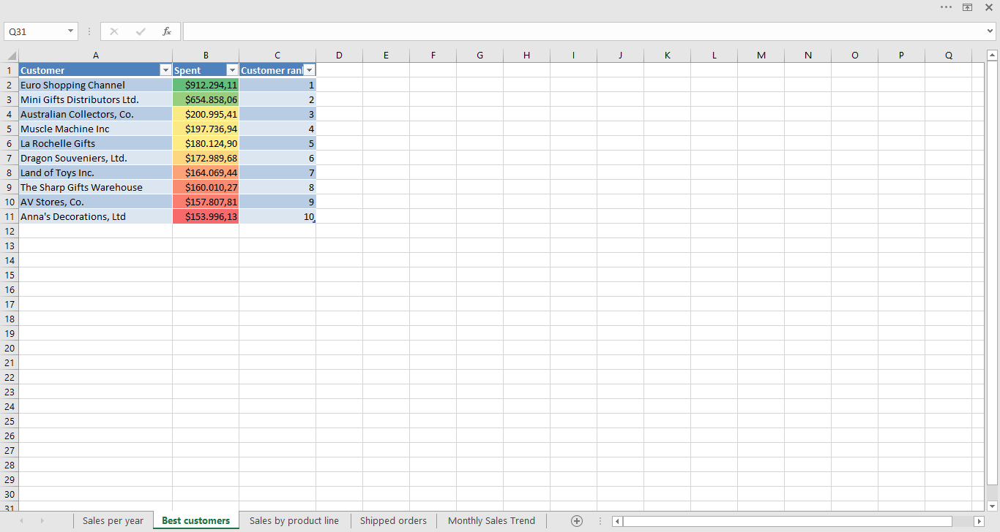
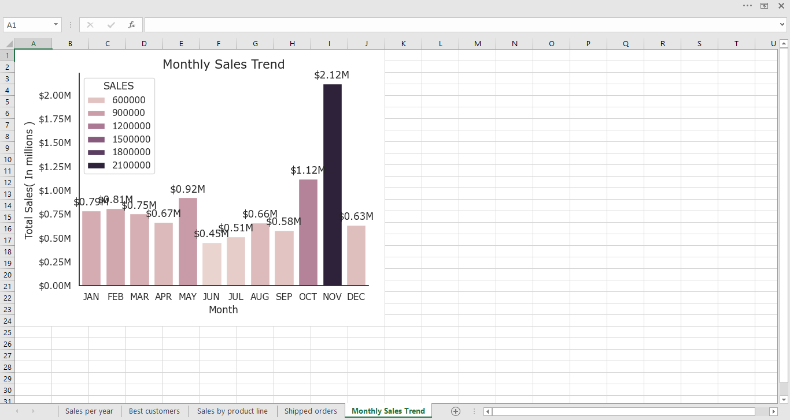

# 📊 Sales Data Automation & Reporting (Python + Excel)

This project reports sales data using Python. It turns a raw CSV into a business-ready Excel report with formatted tables, visualizations, and conditional formatting (red-yellow-green color scales).

---

## 🛠️ Tools & Libraries Used
- `pandas` – Data manipulation and analysis
- `seaborn`, `matplotlib` – Data visualization
- `openpyxl` – Excel file creation, formatting, and styling
- `csv` – Data sample
- `jupyter` – Used for development and experimentation

---

## Features 

### ✅ Monthly Sales Visualization
- Seaborn bar chart of monthly sales
- Formatted with dollar labels
- Saved as `sales_trend.png`

### ✅ Excel Report Generation
- Multi-sheet Excel file (`sales_data_report.xlsx`)
- Each sheet includes:
  - Auto-styled Excel tables
  - Conditional formatting (red-yellow-green gradients)

## Screenshot

